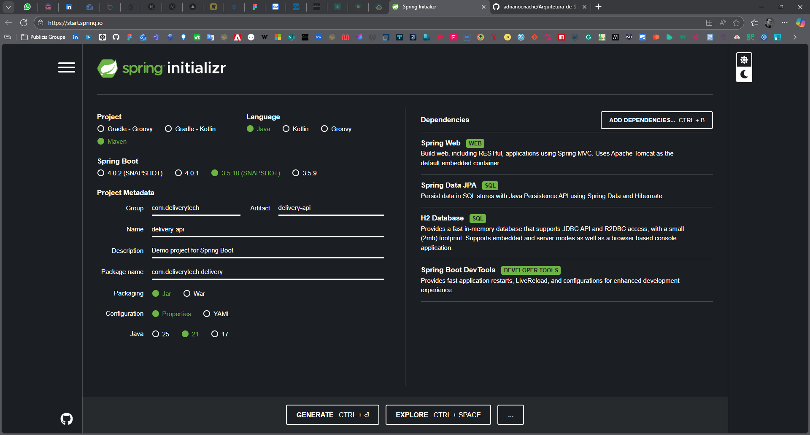
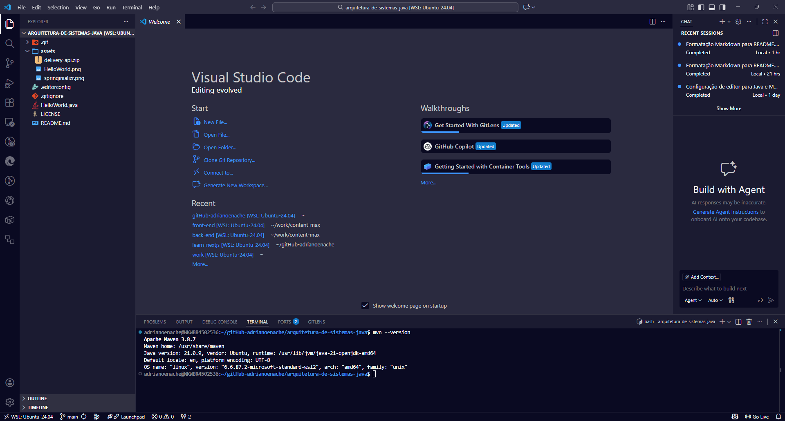
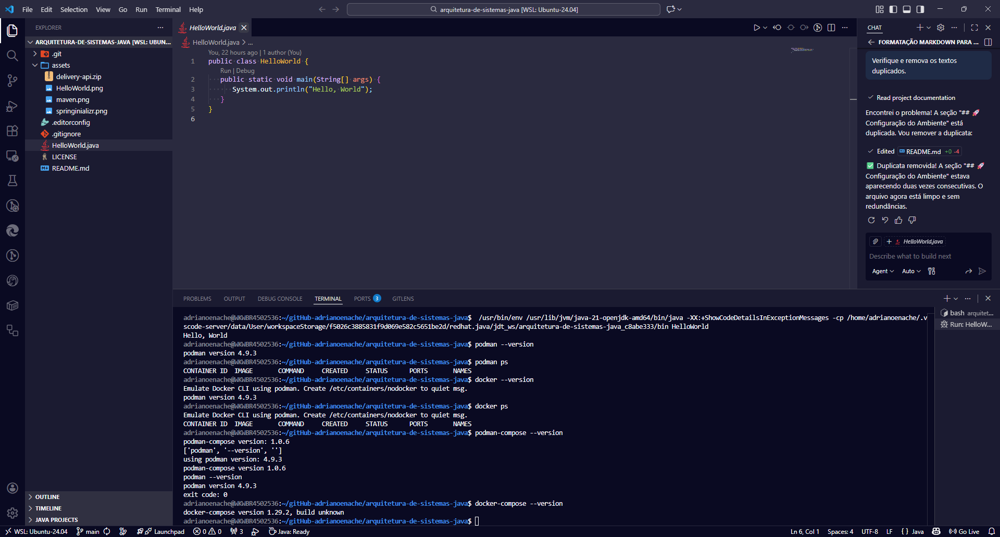
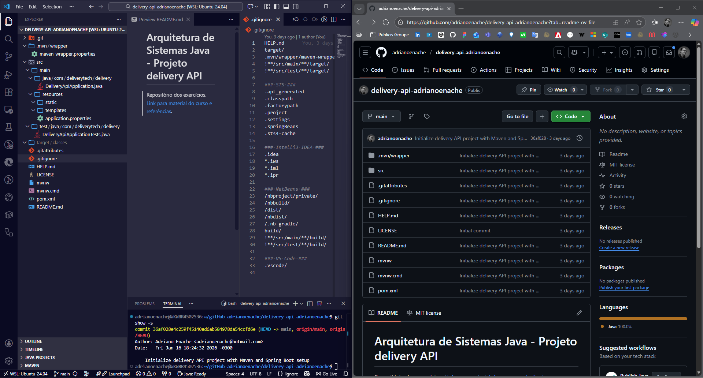
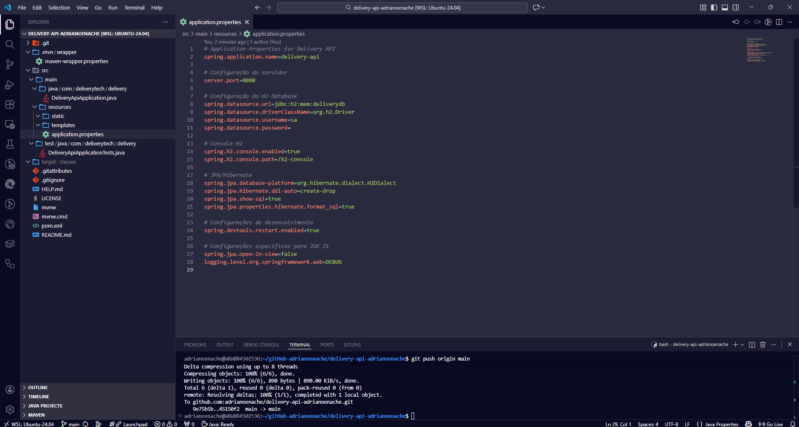
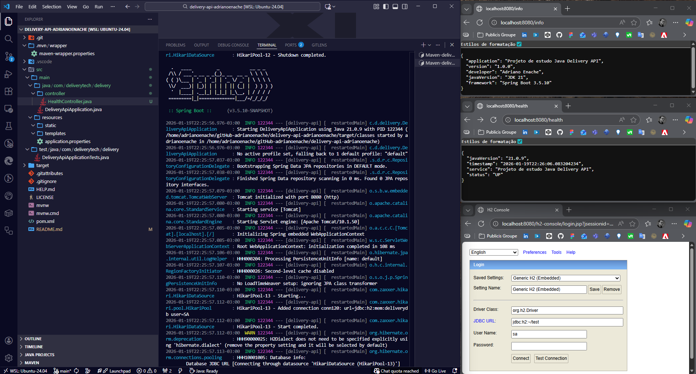

# Arquitetura de Sistemas Java

Este repositório contém estudos sobre **arquitetura de sistemas** utilizando **Java**, incluindo exemplos práticos, referências e recursos educacionais. [Repositório dos exercicios](https://github.com/adrianoenache/delivery-api-adrianoenache).

---

## 🚀 Configuração do Ambiente

### 🖥️ Setup Windows WSL2

Links para os guias de instalação dos itens necessários.

#### Dependências Principais

- [WSL2](https://learn.microsoft.com/pt-br/windows/wsl/) - Windows Subsystem for Linux 2
- [Node.js no WSL2](https://learn.microsoft.com/pt-br/windows/dev-environment/javascript/nodejs-on-wsl)
- [Docker](https://docs.docker.com/install/) - Containerização
  - [Guia de instalação no WSL2](https://learn.microsoft.com/pt-br/windows/wsl/tutorials/wsl-containers)
- [Podman](https://podman.io/) - Alternativa sem daemon ao Docker
- [VSCode](https://code.visualstudio.com/Download) - IDE recomendada
- [Git](https://git-scm.com/download/linux) - Controle de versão (última versão estável)

#### Configuração de Git

- [Configuração de Git](https://git-scm.com/book/en/v2/Customizing-Git-Git-Configuration) - Guia oficial

##### Configuração de Acesso SSH

- [Guia GitBook - SSH Public Key](https://git-scm.com/book/en/v2/Git-on-the-Server-Generating-Your-SSH-Public-Key)
- [GitHub - Gerar chave SSH](https://docs.github.com/en/authentication/connecting-to-github-with-ssh/generating-a-new-ssh-key-and-adding-it-to-the-ssh-agent)
- [GitLab - ED25519 SSH Keys](https://docs.gitlab.com/ee/user/ssh.html#ed25519-ssh-keys)
- [Bitbucket - Configurar chave SSH](https://support.atlassian.com/bitbucket-cloud/docs/set-up-an-ssh-key/)

#### Banco de Dados

> **Nota:** Este item é opcional. Os projetos possuem o banco de dados instalado no container do Docker.

- [Bancos de dados - WSL2](https://learn.microsoft.com/pt-br/windows/wsl/tutorials/wsl-database)

---

## 🛠️ Java & Ferramentas de Desenvolvimento

### Documentação e Instalação de Java

- [Java Oficial](https://www.java.com/pt-BR/)
- [Documentação Oracle Java](https://docs.oracle.com/en/java/)
- [Instalação do JDK no Windows - Oracle](https://docs.oracle.com/en/java/javase/21/install/installation-jdk-microsoft-windows-platforms.html)
- [Instalação do Java em WSL2 - Sourcetrail](https://pt.sourcetrail.com/Java/instalar-java-em-wsl2/)
- [OpenJDK 21 DevDocs](https://devdocs.io/openjdk~21/)
- [Repositório OpenJDK GitHub](https://github.com/openjdk)

### IDEs e Editores

- [Documentação de Java - Visual Studio Code](https://code.visualstudio.com/docs/languages/java)
- [Tutorial de Java - Visual Studio Code](https://code.visualstudio.com/docs/java/java-tutorial)
- [Spring Framework](https://spring.io/)

### Build & Dependências

- [Maven - Guias Oficiais](https://maven.apache.org/guides/)
- [Spring Boot Initializer](https://start.spring.io/) - Configuração de projetos Spring

### Ferramentas Online

- [MyCompiler](https://www.mycompiler.io/pt) - Compilador online
- [MyCompiler - Nova Janela Java](https://www.mycompiler.io/pt/new/java) - Ambiente isolado para Java
- [Excalidraw](https://excalidraw.com/) - Desenho de diagramas e arquiteturas

---

## 📚 Recursos Educacionais

### Plataformas de Aprendizado

- [Fundação FAT](https://portal.fundacaofat.org.br/)
- [Plataforma de Estudo - FAT](https://fat.estudar.life/)
- [Dev Java - Learn](https://dev.java/learn/)
- [Linux Tips](https://linuxtips.io/)
- [Treinamentos Essentials - Linux Tips](https://linuxtips.io/treinamentos-essentials/)
- [Java: o que é, linguagem e um Guia para iniciar na tecnologia](https://www.alura.com.br/artigos/java)

### Materiais de Referência

- [Notion - Arquitetura de Sistemas Java](https://www.notion.so/T1-2601-Arquitetura-de-Sistemas-Java-2e66c869dff28176aeeff1989bb13e54)
- [Repositório GitHub - Delivery Tech](https://github.com/andersonbuenos/delivery-tech)
- [Aula de nivelamento POO](https://github.com/andersonbuenoso/controle-estoque/tree/main)
- [Exemplo de SQL](https://www.mycompiler.io/view/7sfmRb8j5PJ)

### Vídeos Educacionais

- [Arquitetura de Sistemas Java - YouTube](https://www.youtube.com/watch?v=m4-HM_sCvtQ)
- [Lucas Dicas Java](https://www.youtube.com/@lucasdicasjava/playlists)
- [Java](https://www.youtube.com/@java/playlists)
- [Spring Framework (O Salvador do Java) // Dicionário do Programador](https://www.youtube.com/watch?v=j_F0cz0em04)
- [Java para Iniciantes: Um Guia Fácil e Prático + Materiais de Estudo](https://www.youtube.com/watch?v=7dhIdVb6y1s)

### Documentação de Referência

#### Java

- [W3Schools - Java Reference](https://www.w3schools.com/java/java_ref_reference.asp)
- [Wikipedia - Java (linguagem de programação)](https://en.wikipedia.org/wiki/Java_(programming_language))
- [Naming Conventions](https://www.oracle.com/java/technologies/javase/codeconventions-namingconventions.html)

#### Padrões de Projeto

- [Design Patterns MVC em Java](https://java-design-patterns.com/patterns/model-view-controller/)
- [MVC com Java](https://www.javaspring.net/blog/mvc-with-java/)

#### Conceritos

- [Os 4 pilares da Programação Orientada a Objetos](https://www.devmedia.com.br/os-4-pilares-da-programacao-orientada-a-objetos/9264)

#### Serviços em Nuvem

- [AWS SDK para Java](https://docs.aws.amazon.com/sdk-for-java/)
- [Google Cloud - Java Documentation](https://docs.cloud.google.com/java/docs?hl=pt-br)

---

## 💻 Exemplos Práticos

### Hello World

### Spring Boot com Spring Initializer

Você pode baixar o arquivo pré-configurado ou fazer sua própria configuração no [Spring Boot Initializer](https://start.spring.io/).

**[⬇️ Download ZIP](assets/delivery-api.zip)**

### Configuração Maven

### Configuração Podman & Docker

### Configuração do Git e GitHub

URL do repositório [https://github.com/adrianoenache/delivery-api-adrianoenache](https://github.com/adrianoenache/delivery-api-adrianoenache)

### Configuração da aplicação

### Teste e Validação

---
